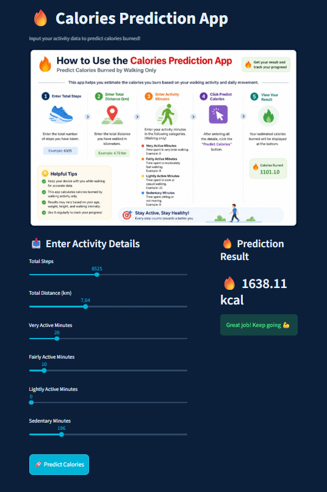
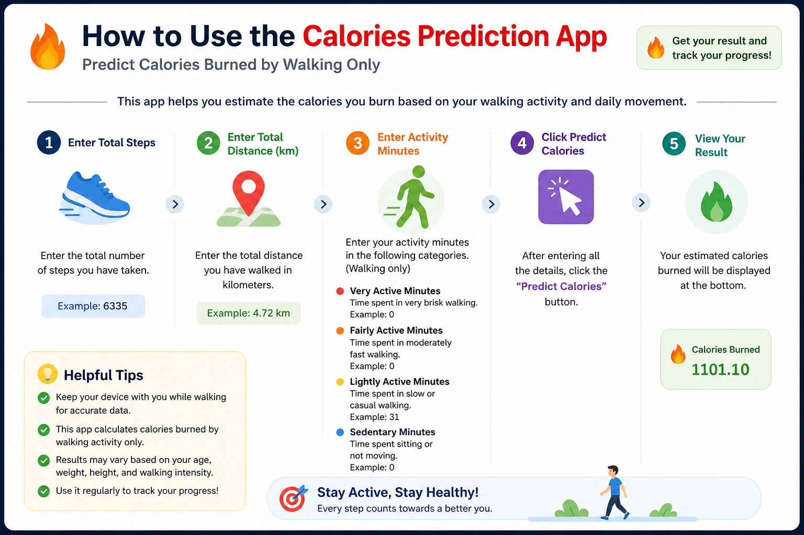

# 🔥 Calories Prediction ML Web App

## 📷 App Preview

🚀 **Live Demo:**
👉 https://calories-prediction-ml-web.streamlit.app/

---

## 📌 Overview

This is an end-to-end Machine Learning web application that predicts calories burned based on daily walking activity such as steps, distance, and activity minutes.

The application is built using **Python, Scikit-learn, and Streamlit**, with a clean and interactive UI for real-time predictions.

---

## 🧠 Machine Learning Approach

### 🔹 Algorithm Used

* **Linear Regression**

  * Suitable for continuous value prediction
  * Fast and interpretable
  * Works well for structured fitness data

---

### 🔹 ML Pipeline

1. Data Cleaning & Preprocessing
2. Feature Selection
3. Train-Test Split
4. Model Training (Linear Regression)
5. Model Evaluation

   * MAE (Mean Absolute Error)
   * RMSE (Root Mean Squared Error)
   * R² Score
6. Model Saving using `Joblib`
7. Deployment using Streamlit

---

## 📊 Input Features

* Total Steps
* Total Distance (km)
* Very Active Minutes
* Fairly Active Minutes
* Lightly Active Minutes
* Sedentary Minutes

---

## 🎯 Output

* Predicted Calories Burned (in kcal)

---

## 🚀 How to Use the App

1. Enter your **Total Steps**
2. Input your **Total Distance (km)**
3. Fill activity minutes:

   * Very Active Minutes
   * Fairly Active Minutes
   * Lightly Active Minutes
   * Sedentary Minutes
4. Click **🚀 Predict Calories**
5. View your result instantly on the right side

---

## 🛠️ Tech Stack

* Python
* Pandas
* NumPy
* Scikit-learn
* Streamlit
* Joblib

---

## 📈 Model Performance

* MAE: ~311
* RMSE: ~408
* R² Score: ~0.73

---

## 💡 Future Improvements

* Add more features (weight, age, heart rate)
* Improve accuracy using advanced models (Random Forest, XGBoost)
* Enhance UI/UX design
* Add user tracking & history
* Deploy using scalable cloud infrastructure

---

## 📷 App Preview

---

## 👨‍💻 Author

**Sumit Ghodke**

🔗 LinkedIn:
https://www.linkedin.com/in/sumit-ghodke-a45a82205/

---

